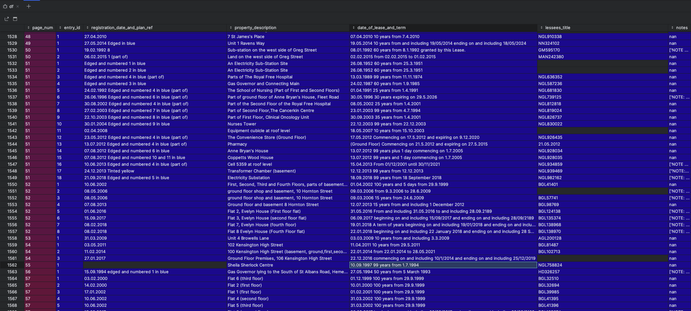
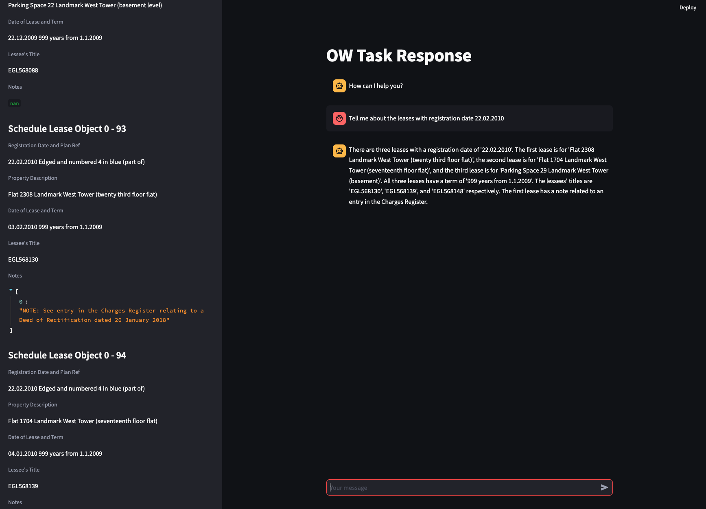

## Problem Statement

 One of the biggest challenges faced in extracting insights from legal
documents is the poor data quality in content coming from the original documents. This is especially true for documents that we have to OCR, but
it can also be seen in third party data sources that we rely heavily on.
One example is a document type that is provided by the Land Registry, known as Title
Registers. Along with the PDFs, we are also able to access structured, digitised content
through the Land Registry’s API. This exercise concentrates on a specific section of these
documents known as the “Schedule of notices of leases” which outlines all of the sub-leases
associated with the parent Title. The schedule is set out in a tabular format within the PDF
document but is returned in a lossy format through the API so in order to make use of the
content, we need to reconstitute the tabular structure.

### Task

The task is to write a program that takes the JSON output from the Land Registry API and structure the data
in the best way possible to represent the original pdf.

The 5 fields of data consist of:

1. Registration date and plan ref: This is the date at which the sub lease was
registered with the Land Registry and a qualitative description of how it is
represented on the Title Plan (a separate document)
2. Property description: Typically the address of the sub lease property
3. Date of lease and term: The date the lease was executed and the duration of the
lease from that date
4. Lessee’s title: The unique identifier for the sub lease property
5. Notes: Any additional information that is relevant to the sub lease

### Solution and Approach

I first approached this problem by looking at the data and trying to understand the structure of the data.
My first thought was to use some sort of regex pattern matching to extract the data from the string.
However, I quickly realised that this would be very difficult to match a 'one solution fits all' 
as the data format is very inconsistent, this echoes the problem statement of poor data quality and returned in a lossy format.

Considerations could be made to use some sort of NLP to extract the data, and it's posssible we can retrieve more structured information this way.
However, for the current scope of the problem, I decided to use a more manual approach to extract the data.

I decided to use a combination of regex and string manipulation to extract the data.
Looping through each line of the data I unpacked the lease schedule and moreover the schedule entry as this contains the data we are interested in.
The main method used is to identify the starting index of each column and best fit the data to the column.
Looking at the data we can see the strings are often of different length, where the maximum length of any line is 73 characters.
The majority of times this is the first line, however, there are some cases where the first line smaller than subsequent lines in the entry.

```python
        pattern = r"\S+(?:\s\S+)*"
        matches = [(match.start(), match.group()) for match in re.finditer(pattern, s)]
```
https://regex101.com/r/1gaHr4/1
The \S+ here matches one or more non-whitespace characters, 
and the (?:\s\S+)* matches zero or more occurrences of a whitespace followed by the same pattern as before. 
The ?: is a non-capturing group, this means we can group the elements where these groups would consist of the content of our data fields listed above.

Above is a simple explanation of how this regex works, note this could be done using a manual string comparison method, however,
I decided to use regex as it felt a cleaner and robust solution. I then used these indices as a marker to know which column we were in.
Where 0 = Registration date and plan ref, 1 = Property description, 2 = Date of lease and term, 3 = Lessee’s title 

Sometimes the data would be slightly misaligned, where on the next line in the entry the data would be shifted a few spaces to the left or right.
In that case the below code was used to find the closest column match.
```pos = min(index_to_word, key=lambda k: abs(pos - k))```

If lines were smaller than the maximum length, I would pad the string with spaces to match the maximum length. This way the alignment to the correct column could be maintained ```text.rjust(len(text) + padding_length)```.
There are cases where they're no matches for any columns where the data has been either lost or missed out, this can be seen below by the blank spaces.



Normally I would go about dropping these rows, or raising an error to the user, however to show the matching process I have left these in.
I've included a series of test cases to show the robustness of the solution, including edge cases where the data is misaligned or missing. This can be ran with the following command ```python  -m unittest discover -s src/  ```
The full parsed data can be found in the *lease_entries.csv* file. 
### Visualisation and Analysis


I've included a skeleton streamlit app which presents the data and sets up a simple UI to interact with the data.
This can be ran with the following commands, including setting up the poetry environment.

```bash
poetry install
poetry shell
streamlit run src/streamlit.py
```

To make use of the Open AI chatbot, you will additionally need to set up an Open AI account and set the API key in the src/.env file.
Here is an example of a question we could ask of the data, 'Tell me about the leases with registration date 22.02.2010' 



